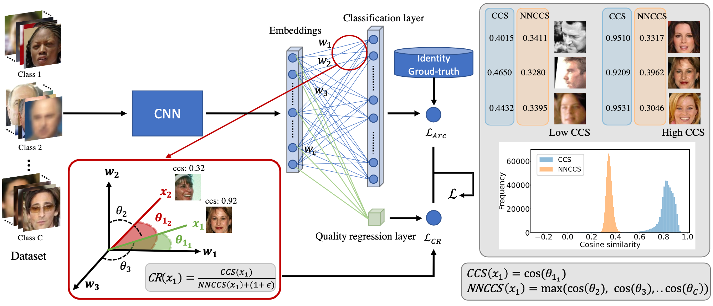

#### This is the official repository of the paper:
### CR-FIQA: Face Image Quality Assessment by Learning Sample Relative Classifiability 
### Paper accepted at [CVPR 2023](https://cvpr2023.thecvf.com/)
Arxiv: [CR-FIQA](https://arxiv.org/abs/2112.06592)

 

<hr/>


## CR-FIQA training ##
1. In the paper, we employ MS1MV2 as the training dataset for CR-FIQA(L) which can be downloaded from InsightFace (MS1M-ArcFace in DataZoo)
    1. Download MS1MV2 dataset from [insightface](https://github.com/deepinsight/insightface/tree/master/recognition/_datasets_) on strictly follow the licence distribution
3. We use CASIA-WebFace as the training dataset for CR-FIQA(S) which can be downloaded from InsightFace (CASIA in DataZoo)
    1. Download CASIA dataset from [insightface](https://github.com/deepinsight/insightface/tree/master/recognition/_datasets_) on strictly follow the licence distribution
4. Unzip the dataset and place it in the data folder
5. Intall the requirement from requirement.txt
6. pip install -r requirements.txt
7. All code are trained and tested using PyTorch 1.7.1
Details are under (Torch)[https://pytorch.org/get-started/locally/]
<hr/>

### CR-FIQA(L) ###
Set the following in the config.py
1. config.output to output dir 
2. config.network = "iresnet100"
3. config.dataset = "emoreIresNet" 
4. Run ./run.sh
<hr/>

###  CR-FIQA(S) ###
Set the following in the config.py
1. config.output to output dir 
2. config.network = "iresnet50"
3. config.dataset = "webface" 
4. Run ./run.sh

## Pretrained model

#### [CR-FIQA(L)](https://drive.google.com/drive/folders/1siy_3eQSBuIV6U6_9wgGtbZG2GMgVLMy?usp=sharing)


#### [CR-FIQA(S)](https://drive.google.com/drive/folders/13bE4LP303XA_IzL1YOgG5eN0c8efHU9h?usp=sharing)

## Evaluation ##
Follow these steps to reproduce the results on XQLFW:
1. Download the **aligned** [XQLFW](https://martlgap.github.io/xqlfw/pages/download.html) (please download xqlfw_aligned_112.zip)
2. Note: if you have an unaligned dataset, please do alignment first using [Alignment](https://github.com/fdbtrs/SFace-Privacy-friendly-and-Accurate-Face-Recognition-using-Synthetic-Data/blob/master/utils/MTCNN_alignment_fast.py)
2. Unzip XQLFW (Folder structure should look like this ./data/XQLFW/xqlfw_aligned_112/)
3. Download also xqlfw_pairs.txt to ./data/XQLFW/xqlfw_pairs.txt
4. Set (in feature_extraction/extract_xqlfw.py) path = "./data/XQLFW" to your XQLFW data folder and outpath = "./data/quality_data" where you want to save the preprocessed data
5. Run python extract_xqlfw.py (it creates the output folder, saves the images in BGR format, creates image_path_list.txt and pair_list.txt)
6. Run evaluation/getQualityScore.py to estimate the quality scores  
    1. CR-FIQA(L)  
        1. Download the pretrained model
        2. run: python3 evaluation/getQualityScorce.py --data_dir "./data/quality_data" --datasets "XQLFW" --model_path "path_to_pretrained_CF_FIQAL_model" --backbone "iresnet100" --model_id "181952" --score_file_name "CRFIQAL.txt"  
    2. CR-FIQA(S)
        1. Download the pretrained model
        2. run: python3 evaluation/getQualityScorce.py --data_dir "./data/quality_data" --datasets "XQLFW" --model_path "path_to_pretrained_CF_FIQAL_model" --backbone "iresnet50" --model_id "32572" --score_file_name "CRFIQAS.txt"
#### Note: Our model process an aligned image using ([Alignment](https://github.com/fdbtrs/SFace-Privacy-friendly-and-Accurate-Face-Recognition-using-Synthetic-Data/blob/master/utils/MTCNN_alignment_fast.py)). The images should be of RGB color space. If you are using OpenCV to load the images, make sure to convert from BGR to RGB as OpenCV converts the color channel when it is loaded with OpenCV read command. All images are processed to have pixel values between -1 and 1 as in [QualityModel.py](https://github.com/fdbtrs/CR-FIQA/blob/main/evaluation/QualityModel.py)         
The quality score of LFW, AgeDB-30, CFP-FP, CALFW, CPLFW can be produced by following these steps:
1. LFW, AgeDB-30, CFP-FP, CALFW, CPLFW are be included in the training dataset folder [insightface](https://github.com/deepinsight/insightface/tree/master/recognition/_datasets_)
2. Set (in extract_bin.py) path = "/data/faces_emore/lfw.bin" to your LFW bin file and outpath = "./data/quality_data" where you want to save the preprocessed data (subfolder will be created)
3. Run python extract_bin.py (it creates the output folder, saves the images in BGR format, creates image_path_list.txt and pair_list.txt)  
4. Run evaluation/getQualityScore.py to estimate the quality scores  
    1. CR-FIQA(L)  
        1. Download the pretrained model
        2. run: python3 evaluation/getQualityScorce.py --data_dir "./data/quality_data" --datasets "XQLFW" --model_path "path_to_pretrained_CF_FIQAL_model" --backbone "iresnet100" --model_id "181952" --score_file_name "CRFIQAL.txt"   --color_channel "BGR"
    2. CR-FIQA(S)
        1. Download the pretrained model
        2. run: python3 evaluation/getQualityScorce.py --data_dir "./data/quality_data" --datasets "XQLFW" --model_path "path_to_pretrained_CF_FIQAL_model" --backbone "iresnet50" --model_id "32572" --score_file_name "CRFIQAS.txt" --color_channel "BGR"
        
     
## Ploting ERC curves ##
1. Download pretrained model e.g. [ElasticFace-Arc](https://github.com/fdbtrs/ElasticFace), [MagFac](https://github.com/IrvingMeng/MagFace), [CurricularFace](https://github.com/HuangYG123/CurricularFace) or [ArcFace](https://github.com/deepinsight/insightface)
2. Run CUDA_VISIBLE_DEVICES=0 python feature_extraction/extract_emb.py --model_path ./pretrained/ElasticFace --model_id 295672 --dataset_path "./data/quality_data/XQLFW" --modelname "ElasticFaceModel"
    2.1 Note: change the path to pretrained model and other arguments according to the evaluated model 
3. Run python3 ERC/erc.py (details in  ERC/README.md)


## Citation ##
If you use any of the code provided in this repository or the models provided, please cite the following paper:
```
@InProceedings{Boutros_2023_CVPR,
    author    = {Boutros, Fadi and Fang, Meiling and Klemt, Marcel and Fu, Biying and Damer, Naser},
    title     = {CR-FIQA: Face Image Quality Assessment by Learning Sample Relative Classifiability},
    booktitle = {Proceedings of the IEEE/CVF Conference on Computer Vision and Pattern Recognition (CVPR)},
    month     = {June},
    year      = {2023},
    pages     = {5836-5845}
}
```


## License ##

This project is licensed under the terms of the Attribution-NonCommercial 4.0 International (CC BY-NC 4.0) license.
Copyright (c) 2021 Fraunhofer Institute for Computer Graphics Research IGD Darmstadt
